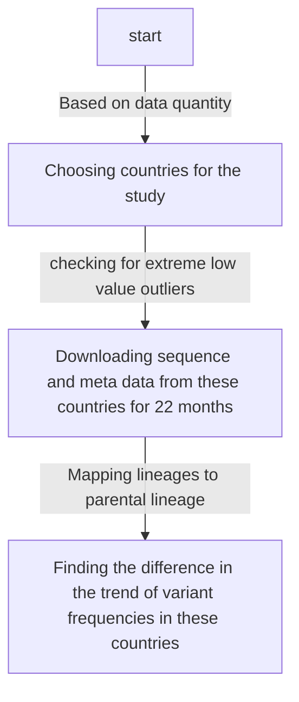

# Objective

Is it possible to predict the positions that are vulnerable for forth coming mutations.

## Steps in the workflow



- [[Question on date|Work_documented.possible_questions#1-whyhow-was-this-particular-time-period-jan22-oct23-chosen-while-pandemic-has-been-prevelant-2020-onwards]]
  
## Data acquisition

- List of locations available in GISAID was obtained from GISAIDR Git repo - [GISAID_LOCATIONS.txt](https://github.com/Wytamma/GISAIDR/blob/master/GISAID_LOCATIONS.txt)
- The following points/steps are coded in the file ```Work/Data_Analysis/Monthwise_data_submission.Rmd```
  - From the GISAID, the total number of **_high_**, **_coverge_** completed sequence deposited by each country (200+) in the past 22 months(Jan2022-Oct2023) were retrieved in a month wise fasion using the R Package GISAIDR. The table is in ```Work/Data_Analysis/country_monthly_submission.csv```
  - Countries that had more than 10,000 sequences deposited in total in the past 22 months were alone considered further.
  - This included 10 countries : India, South Korea, Denmark, Germany, Norway, Spain, United Kingdom, Canada, USA, Australia. ```Work/Data_Analysis/chosen_ten_country_submission.csv```
  - The trend of the time series submission statistics of these countries were plotted. It is present in the file ```Work/Data_Analysis/plots/ten_Country_data_trend_plots.pdf```
  
  - Outlier detection and pruning of the observation horizon(Time period considered): Extreme low values were searched for, using the [[Hampler Filter|Glossary#hampler-filter]] (one of the [[Outlier Estimation and methods|Glossary#outlier-estimation-and-methods]]). outliers_mad from Routliers package was used . Since there were no extreme low values found in any of the countries, the observation time period was not pruned.
  - The sequence data for 10 countries were downloaded. There are files with crude data - all data retrieved from GISAID for each of the accesssion ID (29 cols of data) and there are files with essential columns: strain,virus,collection_date,country,pangolineage,sequence, length of the sequence, GISAID accession_id. The crude data for 10 countries are present 10 files in the folder ```Work/Data_Analysis/ten_country_crude_data_seq``` and the essential column files are in the folder ```Work/Data_Analysis/ten_country_ess_data```
  - The Rmd also has a codeblock for downloading data with AA_substitution. This data was needed for mapping lineages to their parental lineage. For this I used the modified download script(modified by me) ```Work/Data_Analysis/Modified_GISAIDRdownload.R```.
    > This can be done by ```fix(Download)``` and modifying the script as we need
  - This mutation data are stored in ```Work/Data_Analysis/ten_country_mut_data```
  
> There were some inconsistencies in the Date entries (only year no month or year and month an no date) such entries were removed.
> On the course of doing this it was identified that the number of entries that was downloaded for each countries do not exactly match the numbers in ```Work/Data_Analysis/chosen_ten_country_submission.csv``` excluding few countries.
> After removing the inconsistent date entries the numbers(downloaded and number in file) for India match.
> The inconsistencies are reported in the file ```Work/Data_Analysis/inconsistencies_in_data.numbers```.
> The number of downloaded entries are more than then numbers in file.
> After looking into it, it was observed that there were few more entries added to these countries in the time gap(around a week) between the compiling ```Work/Data_Analysis/chosen_ten_country_submission.csv``` and downloading data. [[Work_documented.checking inconsistencies]]
## Summary
Summary of the downloaded data

| **Country**                 | **Total number of entries downloaded (Jan22-Oct23)** | **Entries after removing the date inconsistencies** | **Number of unassigned** | **Percentage of unassigned** |
| --------------------------- | ---------------------------------------------------- | --------------------------------------------------- | ------------------------ | ---------------------------- |
| **Asia / India**            | 18106                                                | 15783                                               | 0                        | 0 %                          |
| **Asia / South Korea**      | 13808                                                | 13808                                               | 0                        | 0 %                          |
| **Europe / Denmark**        | 163900                                               | 163900                                              | 7                        | 0,004 %                      |
| **Europe / Germany**        | 66374                                                | 66236                                               | 0                        | 0 %                          |
| **Europe / Norway**         | 12264                                                | 12264                                               | 0                        | 0 %                          |
| **Europe / Spain**          | 17991                                                | 17921                                               | 0                        | 0 %                          |
| **Europe / United Kingdom** | 32835                                                | 30597                                               | 74                       | 0,242 %                      |
| **North America / Canada**  | 20791                                                | 20791                                               | 0                        | 0 %                          |
| **North America / USA**     | 75487                                                | 74971                                               | 5                        | 0,007 %                      |
| **Oceania / Australia**     | 13267                                                | 13257                                               | 5                        | 0,038 %                      |

[[Note on the unassigned|Work_documented#dealing-with-the-unassigned]]

## Mapping lineages

- Mapping of lineages to their parental lineage is done based on the Pangolin lineage naming string and the spike mutations:

  - From the 10 files of ```Work/Data_Analysis/ten_country_mut_data``` the columns corresponding to the mutations and pango lineage were extracted and stored in a different file ```Work/Data_Analysis/ten_country_mut_data/ten_country_lineage_mut.csv```.
  This is done using awk command

```Bash
awk -F";" '{gsub(/[()]/,"",$6);print $5";"$6}' 
ten_country_mut_data/* \
>ten_country_mut_data/ten_country_lineage_mut.csv
```

  >gsub is used to remove the brackets in the AA_mutations column.<br>
  >Columns of the CSV files are separated by a semicolon ';'

- All the following steps are coded in the Rmd file ```Work/Data_Analysis/Lineage_mapping.Rmd```
  - All the mutations pertaining to each of the lineage were combined.
  - From this only the spike mutations were considered for the downstream work.
  - Jaccard index (intersections of sets/Union of sets). If the Jaccard value calculated  is less than 0.5 then the lineages being compared are either considered as parental or neighbour depending on their pangolin string. [[Question on the treshold|Work_documented.possible_questions#3-the-jaccard-index-treshold-chosen-to-decide-a-parent-or-a-neighbour-is-50-is-this-okay]]
    - The Lineages were mapped to parental lineage based on the the calculated jaccard value which is based on the number of common spike mutations between pangolin lineages that have same names dropping the last character in the sublineage. VOC/VUM/VOI were explicitely mapped based on the list taken from GISAID.
  - For Pangolin lineages that are considered as VOI/VUM/VOC, the  mapping is directly given in GISAID. This can be found in the file ```Work/Data_Analysis/GISAID_VOI_VOC_VOM_list.txt```.
    - This list was obtained by first downloading the Clade/Lineage,variants(tsv) from the GISAID Downloads prompt.
    - This tsv file has multiple columns. Interesting columns were type and Value. Using the following bash commands the list of GISAID_VOI_VOC_VOMlist.txt was compiled

    ```bash
    awk -F\t '{if($3=="Variant") print $4}' \
    gisaid_variants_statistics_from_gisaid.tsv | \
    sort -u >GISAID_VOI_VOC_VOM_list.txt
    ```

    - The resulting text has long lines like _**VOI GRA (EG.5+EG.5.*) first detected in Indonesia/France**_
    from this only the variant and sublineage names EG.5+EG.5.*  are retained while other texts including the brackets are removed(manually).
    - Lines are rearranged in such a way that parental variant comes after the subvariant, example: XBB+XBB.\*    would come only after XBB.1.16+XBB.1.16.*. This rearrangement was done manually.
  
  - In total there are 1628 unique lingeages which includes variants also. Running the mapping algorithm on this gives 715 lineages mapped to 16 variants and 913 lineages getting mapped to 531 lineages which includes Unknown.
  
  > If muation list is obtained using the outbreakinfo function getMutationsByLineage then the results vary for the non-variant lineages. 912(without unknown) lineages gets mapped to 676 lineages. This is present in assigning_the_unassigned.RMD

## Frequency computation
  
- After the lineage mapping, for each country the frequency of presence of each parental_lineage(which also includes the sublienages) in a month was calculated ($\frac{count\space of\space lineage\space B\space in\space jul}{total\space entries\space in\space jul}$) with confidence interval and plotted.MultinomCI from DescTools package is used to compute the simultaneous [[Confidence interval|Glossary#confidence-interval]]. This function also calculates frequency/proportion so a seperate computation was not required.95% confidence interval with method sisonglaz was computed. The plots are stored in PDF file, 1 plot for each country so 10 pages - ```Work/Data_Analysis/plots/country_wise_frequency_trend.pdf``` without CI and ```Work/Data_Analysis/plots/country_wise_frequency_trend_CI.pdf``` with CI.
- To make it more convenient plots for each Parental_lineage/variant grouped by country was plotted to do the analysis. These are present in the pdf files - ```Work/Data_Analysis/plots/Variant_wise_trend_all_countries.pdf``` without CI and ```Work/Data_Analysis/plots/Variant_wise_trend_all_countries_CI.pdf``` with CI
- These plots are analysed to bring out the difference in the variant trend among countries. An entire spreedsheet was developed manually basically describing the variant trends in words ```Work/Data_Analysis/plot_Analysis_report.numbers```, and the summary of the analysis is in [[Analysing_variant_trends]] file.
- To not miss on the difference of pandemic in countries the lineages which are not variants were also used for comparison like the variants. There are 300+ plots in the file each page corresponding to one lineage which is not a variants and the data is grouped by country. This is presetn in ```Work/Data_Analysis/plots/Lineages_no_var_freq_countrywise_CI``` with CI and in ```Work/Data_Analysis/plots/Lineages_no_var_freq_countrywise``` without CI.
- From these plots trends that look interesting are chosen and noted in [[Analysing_variant_trends]]

## Dealing with the unassigned

- For few entries of the GISAID downloaded data the lineage was not assigned. The lineage column had either a blank space or it was termed as unassigned. There were in total 91 unassigned entries in the downloaded 10 country data.
- Denmark 7 entries ,UK 74 entries, USA 5 entries, Australia 5 which is Denmark 0.004%, UK 0.242%, USA 0.007%, Australia 0.038% of the entries in the respective countries.
- Majority of the unassigned entries were collected in Oct23
- To get the possible assignment for these entries few methods were tried out.
- First among them was to calculate distance between the unassigned and all other lineages based on their spike mutations. For this process the characteristics mutation for each lineage was obtained using the outbreakinfo function *__getMutationsByLineage__*. Lineages that had less distance to each of the unassigned entries were considered as possible assignment.
- Though this method seems to work when the method was checked with entries with known assignments, the method did not perform well.
- The main reason that this wouldn't work is beacuse not all the characteristic spike mutation is always present in the GISAID downloaded data, so when distance is computed there is always discrepencies.
- Hence to go with an accurate method genome sequences of these unassigned entries were obtained and a fasta file was compiled.
- This file ```unassigned_sequences.fasta``` was uploaded in the <https://pangolin.cog-uk.io> to get the assignment.
- Once the assignment was obtained it was added to the dataset. This part is included in the fill_parental function of lineage_mapping. The trends were reanalysed after assigning the unassigned.
  > The <https://pangolin.cog-uk.io> was not able to analyse the 5 sequences from australia. No reasons was provided.


- All these are present in the ```Work/Data_Analysis/assigning_the_unassigned.Rmd```

## Finding positions under pressure (BIG GOAL)

The big goal is to find the positions under pressure. To obtain this, firstly the frequency of  mutation on each position of Spike RBD and NTD Epitopes are calculated. (RBD spike mutations in position 330-530, NTD(14-20,140-158,245-264) mutations)([[Question on the position|Work_documented.possible_questions#5-aaccording-to-uniprot-the-rbd-region-in-spike--is-319-541aa]]) For this the aa_substitution data obtained from GISAID was used.


**STEPS:**

- For Each country the mutation data from GISAID has been used as the input.
- This data consist of the lineage, collected date, location of collection, a string of aa_substitution.
- All the aa_substitution strings that are collected on the same day are considered together. This also gives the number of entries collected in a day = number sequences colleceted on a day.
- From these strings the spike RBD, NTD epitope mutations are alone extracted using getintrmut function.
- The data frame gets reduced to date,number of sequences,spike RBD/NTD mutations string.
- To calculate the frequency of a mutation for a time step, all the possible unique spike RBD, NTD mutations present in the country is first compiled.
- Then the frequency of each of this mutation for a day is calculated.
  > Frequency of pos_373 on 01-01-2022 = $\frac{count\space of\space mutations\space in\space pos\_373\space on\space 01-01-2022}{Number\space of\space sequences\space on\space 01-01-2022}$
- To have the frequency data for everyday from Jan 1 2022 - Oct 31 2023, linear [[interpolation|Glossary#interpolation]] is done using the approximate method. The result of the interpolation is added to the corresponding date in the country data_frame. This step is necessary to fill in the data gaps.
  
[[Question on interpolation|Work_documented.possible_questions#4-why-do-we-do-linear-interpolation-why-not-spline-interpolation]]

## Computing the pressure on the position

With the formula (given by Prof.Max) the pressure on each position from t<sub>0</sub> to t was computed
$\\ P(pos,t)=\sum_{s=t_0}^{t}\exp^{-k[t-s]}\times f(pos,s) \\$

- Where the f(pos,t) is the frequency of the position on time t.
- $exp^{-k[t-s]}$ is the discount factor - mutation frequencies that occurred [t-s] days ago get discounted by the half life of neutralising antibodies.
- $k\sim \frac{ln(2)}{45+14}$
- By suggestion of the Prof. the vector for discount factor was first computed. For this the date range for each of the country_df was found. If the difference between the start day and the end day is 9 then [t-s] could be in the range 0-9. Hence with this as base the discount factor was computed for [t-s] ranging 0-[difference between the start day to end day in the dataframe]. All these values are stored in a vector.
- From the start date to the end date the pressure was calculated for everday in the following manner
- $$$\\
  P(pos,d1)=\exp^{-k[d1-d1]}\times f(pos,d1) \\
  P(pos,d2)=\exp^{-k[d2-d1]}\times f(pos,d1) + \exp^{-k[d2-d2]}\times f(pos,d2)\\
  P(pos,d3)=\exp^{-k[d3-d1]}\times f(pos,d1) + \exp^{-k[d3-d2]}\times f(pos,d2)  + \exp^{-k[d3-d3]}\times f(pos,d3)
  $$$
- This was done for all the RBD, NTD positions in a country and repeated for all the 10 countries.
- The output will have one column with the RBD and NTD positions and with columns as many as the number of days with data in the country
  

## Masking

- The objective of masking to find the exposed positions among the RBD, NTD spike positions.
- To know the exposed residues the solvent accessibility of each of the residues in the spike protein were found. [[Question on solvent acessibility|Work_documented.possible_questions#6-if-a-rbd-spike-position-in-the-wildtype-is-occupied-by-a-hydrophobic-residue-and-it-is-replaced-by-hydrophilic-residue-the-solvent-accessibility-might-change-probably-due-to-the-difference-in-the-fold--in-that-case-should-we-study-these-positions-in-each-of-the-voi]]
- To find solvent accessibility of the protein various tools were utilitsed. This can be found here[[Work_documented.Finding_surface_residues]]
- From the output of each of the tool Spike RBD,NTD surface positions were found. This process was direct in the case of the output from GetArea and Netsurf3.0 but in the case of DSSP, relative solvent accessibility was computed from the absolute solvent accessibility in the dssp output file. Using this computed relative solvent accessibility the surface residues were found.
  
> The categorising treshold is set as 25% similar to Netsurf3.0. This would need advice.

- The number of surface residues flagged by the 3 tools vary.
  
  - Dssp : 74 residues, NetSur3.0 : 123 residues, GetArea : 50 residues. All three tools flags 36 positions in common, GetArea and netsurf flags 38 common positions, dssp-getarea 48 positions in common, dssp-netsurf 54 positions in common.
  - Dssp : 12 NTD, 62 RBD
  - GetArea: 8 NTD, 42 RBD
  - Netsurf: 22 NTD, 101 RBD
- Residues flagged by each of the tools are fished from the ten country's position under pressure dataframe. The numbers are tabulated .

The positions being picked by each of the tools are compared with the positions given by Prof.Max(screenshot). The tabulation is available in ```Work/Data_Analysis/Positions_being_picked.numbers```

## Visualization of the positions under pressure

Like previous variant trend visualization, the pressure trend was also visualised using geom_line in two ways, positionwise and countrywise. These plots are present in ```Work/Data_Analysis/pressure_plots```. There are 6 plots - 3 countrywise, 3 positionsise. The 3 denotes the 3 masking tool outputs that were used to generate the plots.

## Entropy for each positions:

The amino acid substitution on a position is not constant. Example: on position 14 mutations found in india include Spike_Q14H,Spike_Q14del,Spike_Q14R. So calculating the number of such prevailing mutations on a position is the entropy. This was calculated to weigh down the pressure on a postiion .... Not processed further yet

## Neutralisation probability:

For knowing how impactful would a mutation on a site be, the probaility of neutralisation is being calculated. The Probability of neutralisation of a variant y by the antibodies elicited by variant x at time t.
$$$
\\
P_{Neut}(t,x,y)=1-\prod_{v\in A_{x/y}}(1-b_v(t,x,y))
$$$
To compute this probability the binding probability $b_v(t,x,y)$ of an antibody of a particular epitope class with the variant is needed.
$$$
\\
b_v(t,x,y)=\frac{exp^{-k[t-s]}}{FR_{x,y}(v).IC50_x(v)+exp^{-k[t-s]}}
$$$

- The discount factor is used here to represent the diminishing concentration of the antibodies elicited by variant x. $FR_{x,y}(v)$ is the fold resistance of a variant y to binding of antibodies of epitope class $(v)$ elicited by variant x [All taken from the lab's paper which is currently in review].
- The probability of binding is computed in the same manner as the pressure. For each postion that is getting mutated, for each of the antibodies the fold resistance and IC50 that was provided was used. These values were obtained from DMS data and was used in the predecessor work of the lab.
- To compute the binding probability the FR and IC50 of antibodies belonging to the same epitope class was averaged and then used to compute the binding probability for an epitope class.
- The resulting dataframe has the position, epitope class, $b_v$ series(for all the days in the observation time line). Binding proability with FR=1 and FR provided in the table were used to comput two resulting dataframes.
- With the computed two binding probability dataframes, two probability of neutralisation dataframes are computed. $P_{1_{Neut}}$ (with FR=1), $P_{2_{Neut}}$. The Probability neutralisation dataframes contains a column for the position, and other columns dedicated for all the time steps.
- To compute the probability of neutralisation, for each position, for each time step, the binding probability of all the antibody classes for the time step are considered.
- The weight is computed by $\frac{P_{1_{Neut}}\space (with FR=1)}{ P_{2_{Neut}}}$.
- The computed weight is then multiplied with the pressure timestepwise and then the weighted pressure is plotted - Positionwise and countrywise; all the positions are considered irrespective of being exposed or burried. ```Work/Data_Analysis/pressure_plots/pos_pressure_trend_avg_wtpressure.pdf```, ```Work/Data_Analysis/pressure_plots/pressure_trend_avg_wtpressure.pdf```
- ```Work/Data_Analysis/Big_goal.Rmd```, ```Work/Data_Analysis/neutralisation_probability.Rmd``` has all the scripts regarding the big goal.

> Another method: binding probability for all the time steps for all the antibodies were computed first and then averaging these binding probability of antibodies across an antibody class was done and used to find the probability of neutralisation. The weight values did not differ drasitically to be precise there are only 116 values that differ. Just sticking to the earlier method.
[Definition Reference](https://www.cdc.gov/coronavirus/2019-ncov/variants/variant-classifications.html)

## Analysis of the weighted plot

- **Overall trend across all the countries:**
  > The plots Pictures represents the overall trend for the grouped positions

  **Grouping positions by similar pressure trends**
  
  The similar trend positions were visualised to see if, the are very near to experience same trend of pressure.
  
  - 373,142,501,19,440,505,478,371,417,376,339,408,375,405,498,477, 484  
  
  > position 19 is missing in the structure

  - 496,143,145 
  
  > position 145 is missing in the structure

  - 493 the trend is like the previous but with an offset in the peak 
  
  > This position is 8.1$\AA$ away from pos 496
  
  - 446,346 
  
  > pos 446 is missing in the structure
  
  - 157,452 
  
  - 158,156 
  

  - 144 similar to the previous but many countries have trends of high pressure at the end of the observation timeline 
 > position 144 not found in the structure

  - 245,153,450,18 
  
  > pos 18,153 are absent in the struct

  - 146,445,368,252,490,460,486 
  
  > 146, 252, 445 are absent in the structure
  
  - 152,147,257,356,444 
  
  >152, 147, 257 are absent in the structure

  - 253,521 
  
  > pos 253 is absent in the structure
  - 455,456 
  

- Visually the positions that have similar pressure trends are not always in proximity on the folded protein. Since this is a static structure, there might be dynamics which can bring these positions together but this is just an hypothesis.
  
- 256 high pressure is observed in only australia at the end of the observation period 
- 344,494 Germany has higher pressure than others  
- 248 India and Norway records high pressure comparing to others 

## Comparison of pressure trend with the variant trend

- To do this the characteristic mutations of each variants were obtained using the **getMutationsByLineage** function from outbreakinfo package. From these the positions were alone taken.
- But set of positions are not exclusive for a variant, there is major overlap. That is positions in first group belongs to the characteristics mutation of almost all the variants. So based on the mutation position pressure trend its difficult to draw a corelation with variant trend.
- Considering mutations would be a better way to go ahead.
- I think considering individual mutations would give allow us to visualise occurance of mutation on a position after the pressure peaks on a position

## Repeating the process with Mutations

- From frequency calculation to computing the weighted pressure the process was repeated again for individual mutations.
- The visualization is slightly different. For each country there is a separate pdf. The pressure trends of mutations on the same positions are plotted together in a graph with each line representing a mutation.
- Few trends are promising.
-  This seems like at the time when the pressure trend of spike_G339O peaks - high vulnerability to be mutated the pressure trend of spike_G339H starts picking up, this corroborates the hypothesis that when the pressure increases there are higher chances for that position to be mutated.
-  In this case the mutant Spike_F157del has exsisted  along side of Spike_F157L. But the pressure on the former increases only after the pressure on the later peaks. This can be interpretted as the former got more favorable conditions to spread more and hence the pressure is going higher.
- But there are trends that needs little more effort to look into   
  
  