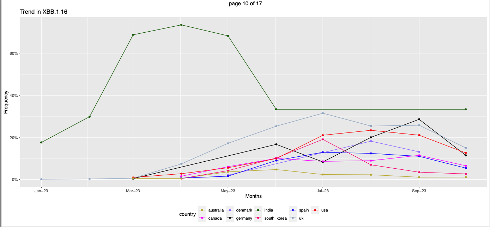
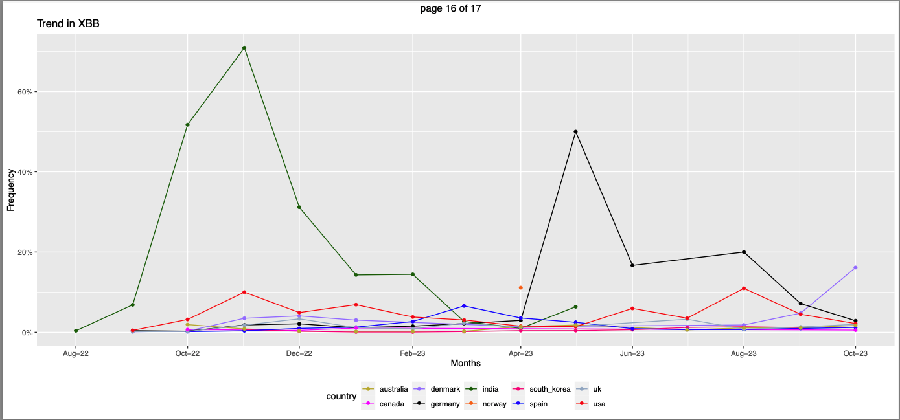
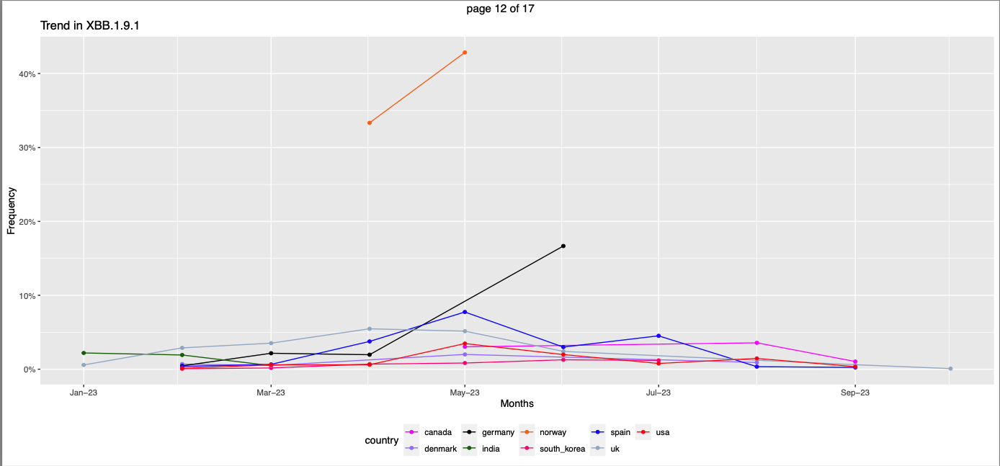
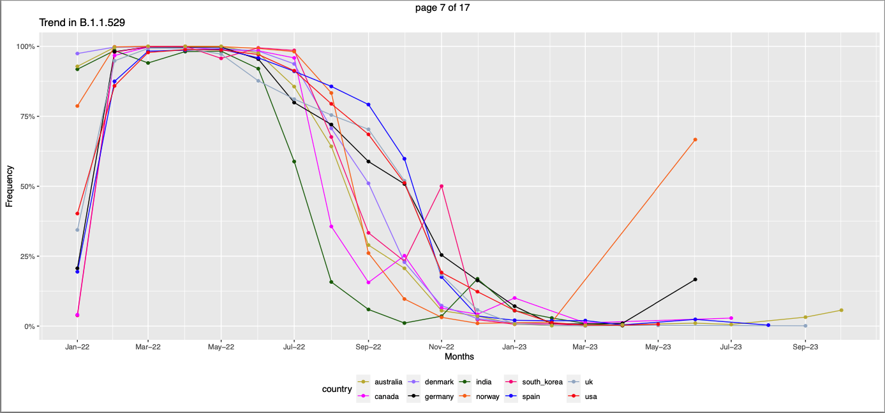
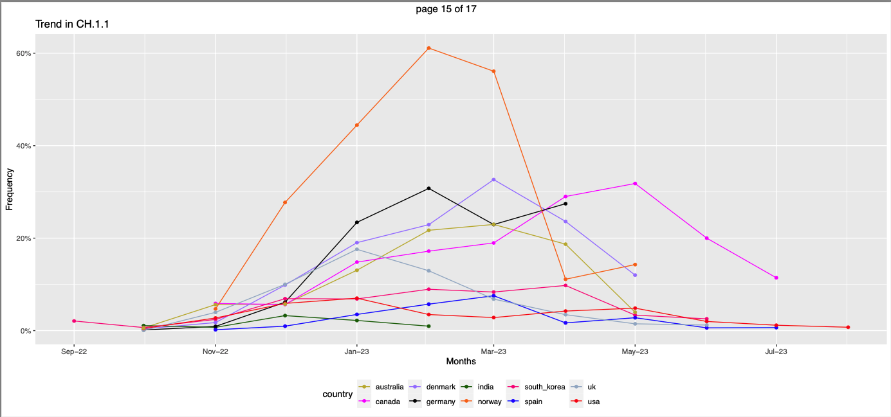
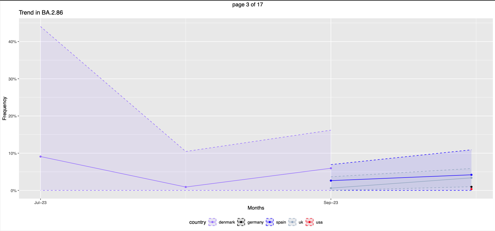
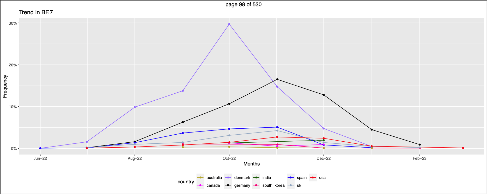
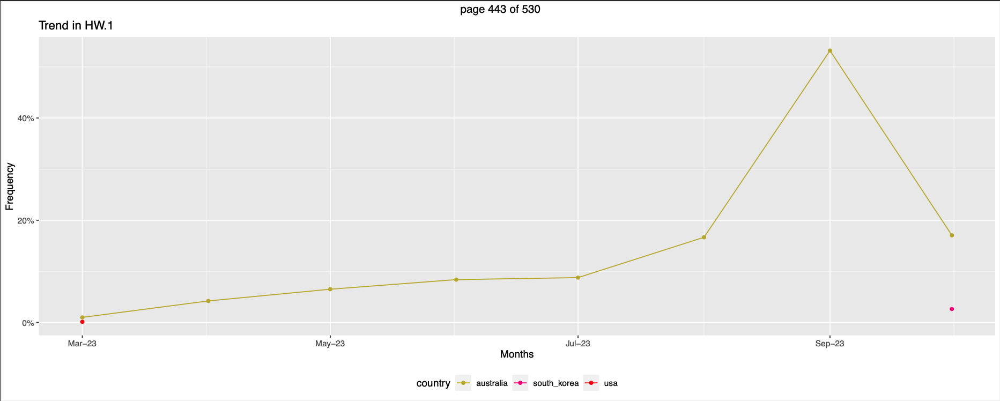

## Inference that are interesting

1. XBB.1.16(omicron):India sees the Spike earlier than the rest of the countries. The lowest frequency in india is higher than peaks of all other countries. 

2. XBB : India and Germany  records the high frequencies 70.92%,50% respectively, while other countries have frequnency less than 20% 

3. Norway doesn't have occurances of XBB.1.9.2,XBB.1.16 while other countries has recorded occurances.

4. EG.5 is more prevalent in Norway and India for two months straight than in other countries 

5. XBB.1.9.1,EG.5 : Norway records occurances only for two months and it is highest than frequencies of other countries. No gradual increase or decrease recorded. 

6. XBB.1.9.1 : not present in Australia

7. B.1.1.529(Omicron): The Final spike after a downhill trend during the last month of occurance(jun23) in Norway(66.66%) and Germany(16%) can be interesting. 

8.  CH.1.1: Norway records high frequencies (61%) compared to other countries. 

> ## 10. BA.2.86
   >
   > + Occurances only observed in Denmark, Germany,Spain,Uk,USA
   > + Though the frequency of all the occuraces in all these countries are less than 10%, by the 95% CI Denmark records the highest frequncy (40%) of occurance in the month of Jul23.
   > + Denmark records occurances from Jul23-Sep23, spain and UK records occurances from Sep23-Oct23. Germany,USA records occurances only in oct23 which is very low 0.9% and 0.3%  respectively.
   

1. No records of the following variants B.1.429(Epsilon), B.1.525(Eta), B.1.526(Iota), C.37(Lambda), B.1.621(Mu), P.3(Theta), P.2(Zeta), B.1.640 in the 10 chosen countries during Jan22-Oct23.

## Interesting plots of lineages not variant

1. BF.7:  Peaks of Denamrk(58.3%) and Germany(29.2%) are notable because no other country has recorded such frequencies for this lineage. And Norway has no trace of this lineage. 
2. BN.1: South Korea had high prevelance of this lineage from Dec22-Mar23 >60%. 
3. BR.2: Australia has this lineage from Jan22-Jun23 way before and after it's occurances in other countries. However the frequency of this lineage in Australia during Oct22-Mar23 is unmatched by any of the other country. 
4. HW.1: Aaustralia has highest frequency of this lineage in the month of Sept23, while other countries have all their frequncies below 20%.And Norway has no trace of this lineage. 
   

## Summary for Variants

### B.1.1.7(alpha)
+ This variants are observed only in 4 countries - Germany,Spain,UK,USA.
+ There are less than 5 datapoints in each of these countries and the frequencies are very low. The range is 0.006% - 0.3%
+ So considering not informative.

### BA.2.75

+ Observed in all the ten countries
+ Except in India, in all other countries the trend starts from the mid of 2022 (jun22-Aug22) . The occurances stop around Dec22 or in the first 3 months of 2023 for  all the countries.
+ In India the occurances start from Jan22 onwards. However the frequency is very low in the start of the year - less than 0.5%. By the 95% CI the values can be atmost around 1.9% in start of 2022. There are no data points observed for the months Feb22,Mar22.
+ India(56.3%),Canada(53%) has recorded the highest frequency (more than 50%) of occurance in the month of Aug22
+ Spain, Uk, Denmark has recorded constantly low frequency (less than 2.5%) in months of their existance from Aug22,jun22,jul22 respectively to Dec22. 
+ For all the countries but Spain,Denmark,UK the highest peaks are observed in the months Aug22 or Sept22.

## BA.2.86

+ Occurances only observed in Denmark, Germany,Spain,Uk,USA
+ Though the frequency of all the occuraces in all these countries are less than 10%. By the 95% CI Denmark records the highest frequncy (40%) of occurance in the month of Jul23.
+ Denmark records occurances from Jul23-Sep23, spain and UK records occurances from Sep23-Oct23. Germany,USA records occurances only in oct23 which is very low 0.9% and 0.3%  respectively.

## B.1.351(Beta)

+ Occurances recorded only in Germany and USA
+ In the Month Mar22 both the countries has data points of 0.01%(Germany) and 0.02%(USA) frequency.
+ Again in sept22 Germany has recorded a datapoint of 0.3% frequency. However by 95% CI upper limit value can go upto 6.3% in sept22

## B.1.617.2(Delta)

+ The occurances are recorded starting Jan22 in all the 10 countries.
+ The trend follows a common pattern in all the countries. High in Jan22 and a drop in Feb22, followed by continuous low frequency. 
+ From the trend I suspect that this variant would have it's first apprarance in the year 2021 which is out of the observation horizon.
+ I confirm my notion by realising this is the delta variant. 
+ USA,UK has frequency of 60%,65% in Jan22. Spain and Germany has frequency around 80% in Jan22. Canada and South_korea has frequency around 96% in Jan22. While countries Denmark,India,Australia,Norway has frequency less than 25% in Jan22.
+ Discontinuous occurance: In south Korea and Australia there are long time periods (more than 6 months) with no occurances and then sudden occurances are noted. For example in South_korea Apr22-Oct22 there are no datapoints and from Dec22-May23 there are no occurances. In USA there are 5 continuous months of no occurance. India has 4 months of No data points. These countries have the trend extending from 2022-2023 but it has many months of no occurnaces.
+ Spain has the longest trend with no long periods of silence. From Jan22-Feb23
+ However apart from the high frequency in the month of Jan22, the frequency trend is quite monotonous with low numbers (less than 5%) in all the countries.

## P.1(Gamma)

+ Occurance recorded only in Uk and only in Apr22 with a low frequency of 0.02%

## B.1.1.529(Omicron)

+ Occurances start from Jan22 in all the ten countries.
+ In all the countries around the months of Feb22-Jun22 the frequency is very high (more than 97%)
+ On Average month from Aug22 onwards the trends are downstream in all the countries. There are some spikes during this downhill trend in South_korea(Nov22),Canada(Oct22),India(Dec22) . The Final spike during the last month of occurance(jun23) in Norway(66.66%) and Germany(16%) can be interesting.

## B.1.617.1(Kappa)

+ Occurance recorded only in India in the months March22-May22. 
+ Highest frequency is 1.1% in Apr22

## EG.5

+ Occurs in all the countries. 
+ In India and Norway the this variant has dominated occurance for 2 months. India - Jul23-Aug23 (100%), in Norway in the only two months of occurance Aug23-Sept23 records a frequency of 100%.
+ The time line of occurance of this variant in all the countries are similar.
+ Norway has the shortest trend Aug23-Sep23

## XBB.1.16(omicron)

+ There are no occurances from Norway
+ India sees the Spike earlier than the rest of the countries. The lowest frequency in india is higher than peaks of all other countries.

## XBB.1.5(omicron)

+ While in most of the countries the datapoints start around Dec22-Jan23, USA sees this variant in Aug22.
+ Peaks in the countries - India,Germany,Canada,Spain,Uk,USA are in the months Feb23-Apr23. 
+ USA records the highest frequency
+ Norway has the shortest trend Mar23-May23.

## XBB 1.9.1

+ Not Present in Australia
+ Norway has the shortest trend but highest frequency (Apr23-May23)
+ In countries except Norway and Canada(May23-sept23) the onset of this varient is in the beginning months of 2023 (jan,feb) .
+ In countries Denmark,Uk, Canada there is a break of continuous 2 months where there is no datapoint

## XBB.1.9.2

+ Not present in Norway
+ There are discontinuous occurances but the periods of no occurance is less than or equal to 2 months.
+ The overall frequency of the occurances in all the country is less than 10%

## XBB.2.3

+ Starts in jan23 in India and is continuous till May23. There is a break of 3 months Jun23,Jul23,Aug23. Then there is a spike(highest frequency) in the month of Sept23-Oct23.(intereseting)
+ Trends of other countries are mostly monotonous.

## CH.1.1

+ Norway records the highest frequency(61%) while for the rest of the countries the highest recorded frequency is 32%(denmark)
+ India has the shortest trend

## XBB(omicron)

+ India and Germany  records the high frequencies 70.92%,50% respectively, while other countries have frequnency less than 20%

B.1.429(Epsilon), B.1.525(Eta), B.1.526(Iota), C.37(Lambda), B.1.621(Mu), P.3(Theta), P.2(Zeta), B.1.640 No data for these variants.

