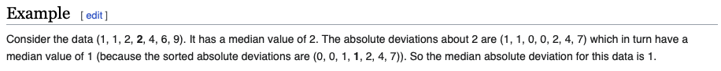

## **Outliers**

### **Point outlier:**

- A point outlier is a datum that behaves unusual in a specific time instant when compared either to the other values in the time series (global outlier) or to its neighboring points (local outlier).[1]

### **Subsequences:**

- This term refers to consecutive points in time whose joint behavior is unusual, although each observation individually is not necessarily a point outlier.[1]

### **Outlier Estimation and methods:**

- If the outlier is obtained based on the past,current and future data then it is called the estimation method. If the outlier is obtained based on only past data then the method is prediction method.
  
- Some methods:
    1. Descriptive statistics :
        - **_Finding maximum and minimum_** in the data - for example if the the data is regarding grades of the students and the maximum possible value is 100 but due to mistake if the data has 1000 as maximum value this can be found by retrieveing the range of the data.
        - **_Histogram_** , **_Boxplots_** of the data can be used to visualise the outlier. In Boxplots all the observations beyond the interquartile range criterion($I=[q_{0.25}-1.5.IQR;q_{0.75}+1.5.IQR]$) is considered as outlier.
        - **_Percentiles_** All the observations that are beyond a percentile of interest is considered as outlier.
  
    2. Statistical tests : These tests requires the data is normally distributed. This can be checked by either visualsing the data using a histogram or using shapiro-Wilk normality test - shapiro.text().
        - Grubb's test: The Grubbs test allows to detect whether the highest or lowest value in a dataset is an outlier.
        - Dixon's test : Tests if a particular value is outlier or not
        - Rosner's test: used to detect several outliers at once.
        - **_Z-Scores_** if the data has a normal distribution. Data are categorised as outliers based on their z-score
  
#### **_Hampler Filter_**

This is also part of descriptive statistics. Considers values outside the interval $I=[median-3*MAD,median+3*MAD]$ as outliers. To understand MAD(median absolute deviation) 

## Confidence interval

In general a 95% confidence interval means there is 95% probability that the confidence interval contains the mean[2]. To understand what is CI of a sample proportion, the term population proportion is defined first.

> A population proportion is the proportion of individuals in a population sharing a certain trait, denoted as p. The sample proportion is the proportion of individuals in a sample sharing a certain trait, denoted ˆp[3].

Just like the estimating the CI of mean the CI of proportion is estimated by adding and subtracting margin of error from ^p to get the limits of CI.
$$$\\
Margin\space of\space Error\space =z\times\sqrt{\frac{\hat p\times(1-\hat p)}{n}}
$$$
Where z is the z-score for 95% confidence level[4].
For multinomial sample prortions the confidence intervals are often approximated by single binomial confidence interval, I assume the trait of iterest is considered as $\hat p$ while others become $(1-\hat p)$. There are also methods to to calculate confidence interval simultaneously. One such method sisonglaz was used in the work through function MultinomCI from DescTools package.

[1]:<https://s-ai-f.github.io/Time-Series/outlier-detection-in-time-series.html>
[2]:<https://www.graphpad.com/guides/prism/latest/statistics/stat_more_about_confidence_interval.htm>
[3]:<https://faculty.etsu.edu/gardnerr/1080/stat4-3.pdf>
[4]:<https://ecampusontario.pressbooks.pub/introstats/chapter/7-4-confidence-intervals-for-a-population-proportion/#:~:text=Similar%20to%20confidence%20intervals%20for,limits%20of%20the%20confidence%20interval.>