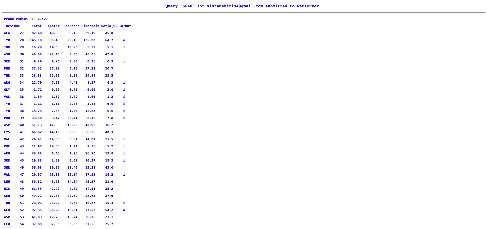

## DSSP server

[DSSP server](https://www3.cmbi.umcn.nl/xssp/)

- Input : PDB file (6xlu)
- The output contains a column names ACC. The values in this column is either number of water molecule in contact with the residue*10 or Residue's water exposed surface in $\AA^2$.

- The ouput obtained was causing problems when read through R.
- To circumvent this, dssp was installed in the system and the protein stucture files (6xlu.pdb) was used to obtain the dssp file.

```{bash}
dssp 6xlu.pdb 6xlu.dssp
```

- This dssp file was parsed in R using the function parse.dssp from ptm package.

## Get Area server

[GETAREA](https://curie.utmb.edu/getarea.html)

- Input: PDB file (6xlu)
- The output contains a columns saying if the residue is inside or outside - represented as (i/o)

- The output is displayed on the webpage
- This output was manually copied and was converted into a csv file after doing some text editing. This way the file could be easily read in R

## NetSurfP 3.0

[NetSurfP 3.0](https://services.healthtech.dtu.dk/services/NetSurfP-3.0/)

- Input: [FASTA sequence](https://www.uniprot.org/uniprotkb/P0DTC2/entry#sequences) is submitted
- Output: It gives the solvent accessibility, relative solvent accessibility which based on a treshold of 25% - more than 25% the residue is exposed, less than that the residue is burried.

- The RSA values can be taken from the csv file which could be downloaded from the result site.

> Note:
> A pariwise sequence alignment was done with the uniprot spike sequence and the sequence obtained from the 6xlu structure.  The sequences align fairly well.