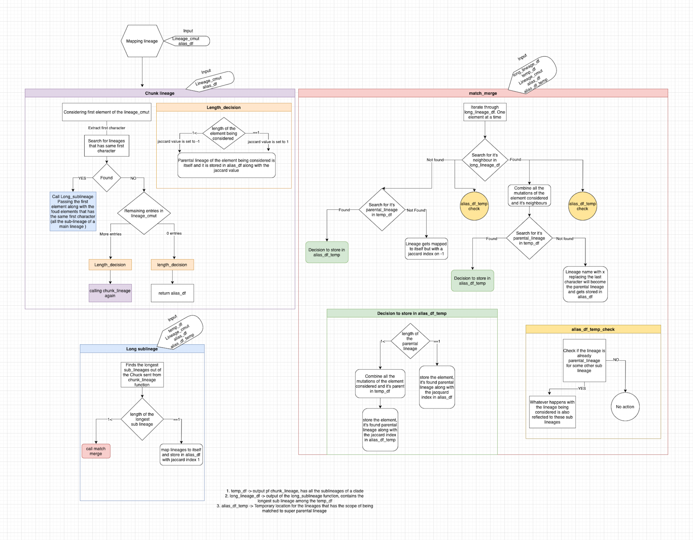

```{Algorithm}
Function mapping_lineages (lineage_cmut,alias_df)

    Function chunk_lineage(lineage_cmut,alias_df)
        
        1.Chunks lineages and sublineages by the first character of Pangolin string. 
        One element of the input data frame is considered at an instance and all the 
        members of the clade to which it belongs are chunked and passed to the downstream 
        processing.

        2. If there are no lineages having the same first 
        character but there are entries in the input df, the lineage is 
        mapped to it's own and is stored in alias_df.

        3. else If the there are no more entries in the 
        lineage_cmut then the lineage is mapped to itself and  return is called.

        4. else the chunk stored in temp_df is passed to
        long_sublineage

    End

    Function long_sublineage(temp_df,lineage_cmut,
    alias_df,alias_df_temp)

        1. Finds the sublineage with longest character string
        and stores it in longlineage_df

        2. If multiple lineages have long character string
        both the lineages are stored in longlineage_df

        3. If linegaes length is just one then it is the
        parental lineage and it is mapped to it's own and is
        removed from temp_df amd is stored in alias_df

    END

    Function match_merge(longlineage_df,temp_df
    lineage_cmut,alias_df,alias_df_temp)

    1. Iterates through the longlineage_df, forms pattern
    from the first element taken and tries to find
    neighbours in longlineage_df based on jaccard value
    using function find_jaccard

        1. If neighbours are found their mutations are
        combined (union).

        2. Checks if these neighbors are paretnal lineage to
        some other lineage in the alias_temp_df

        3. Checking if there is a parental lineage to the
        neighbours in the temp_df

        4. If parental lineage is found and if the length of the parental 
        lineage string is more than one, the mutations of the
        neighbours and the parernal lineages are again
        combined (union) and stored in the place of 
        mutations of the parental lineage in temp_df. Neighbours are 
        mapped to their found parent and are stored in alias_df_temp, 
        since there is potential for surther mapping. This parental 
        lineage also becomes the parental lineage for the 
        sublineages that had these neighbours as parental 
        lineage in alias_df_temp.These neighbors are removed from 
        longlineage_df and the loop is iterated for the next round.
        
        5. Else if the length of the parental lineage is 
        equal to 1 then everything in the previous point 
        that was written in the alias_df_temp is written to
        alias_df. Mutations are not meddled with, since it is 
        the ultimate paretnal lineage and there is no go further.

        6. If no parental lineage was found then the the
        Neighbours are mapped to the pattern which is the
        name of the neigbors without the last character. This
        pattern concatinated with x becomes the parental 
        lineage of the neighbors. This also becomes the 
        parental lineage for those sublineages for which the 
        nighbors were parental lineage.

    2. If there are no neighbors found

        1. Code directly starts finding the parental 
        lineage for the element being considered.

        2. If paretnal lineage is found and the length of 
        the lineage is more than 1, the element in hand 
        is mapped to the found paretnal lineage and jaccard 
        value is stored in the alias_df_temp.  Mutations of 
        the element and the found parental lineage is combined and 
        stored in the place of the parental mutations in temp_df

        3. Sublineages for which the lineage in hand is the parental
        lineage in alias_df_temp gets mapped to the newly found parental lineage.

        4. If the length of the parental lineage being 
        found is equal to one then point 2,3 is repeated 
        but difference would be that instaed of 
        alias_temp_df, alias_df is used and mutations are not meddeled with.

    3. If no parerntal and neighbors were found

        1. The lineage being considered is mapped to 
        itself.

        2. For sublineages in the alias_df_temp that has 
        the lineage being considered as parental lineage is 
        remains the same. It is just transfered to 
        alias_df with no changes.

    
    Once the longlineage_df has been fully processed if 
    there are entries in temp_df long_sublineage is called else chunk lineage is called.
    


    END

End
```

```{Algorithm}
Function find_jaccard(pat,search_df,pat_mutations=0)

    search_lineage_loc<-grep(pat,search_df$lineage)

    1. If pat_mutations==0 means the function is finding the
    neighbours. Else the function is overloaded
    to find the parental lineage.

    2. If pat_mutations==0 the length(search_lineage_loc) should be
    more than 1 - neighbours other than the lineage in hand.

    3. If no neighbours were found then function returns 
    neighbours="0", jaccard_value=-1,neighbour_loc=0

    4. Other than point 2 the overloaded function does the
    same functionality for both the overloaded purposes
    and returns jaccard value, neighbours, neighbour_loc 
End
```

```{Find parental}
Function Find_parental(pat,parental_df)

    1. Recursively searches with the pattern 
    until it finds the parental lineage satisfying 
    the conditions 
    2. The pattern is shortened every iteration.
End
```

[[question on the treshold|Work_documented.possible_questions#3-the-jaccard-index-treshold-chosen-to-decide-a-parent-or-a-neighbour-is-50-is-this-okay]]
