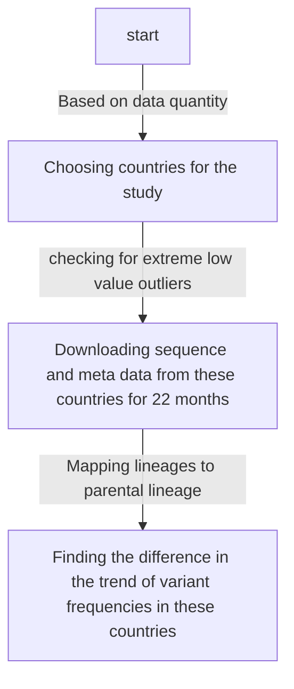
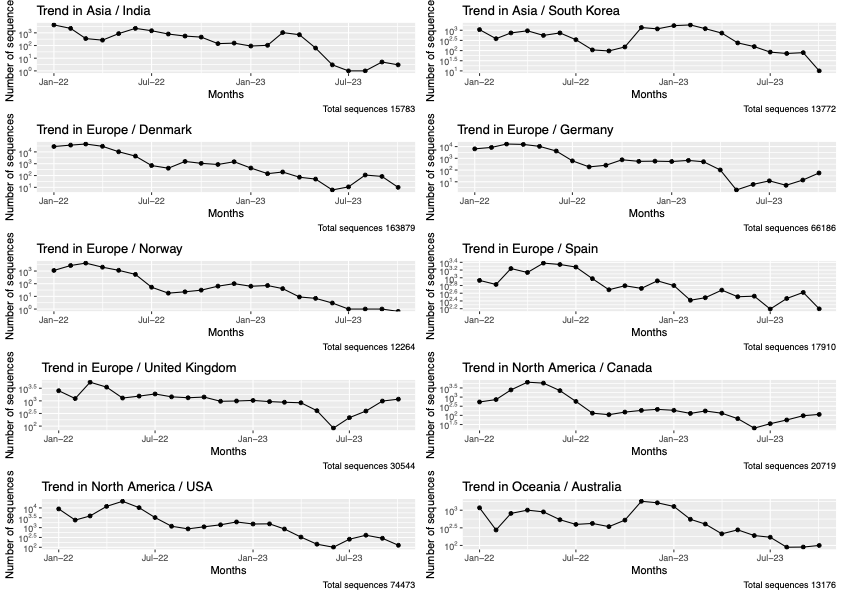

# Objective

The study is regarding the role of population genetics in the determining the susceptibility to a SARS CoV19 variant.

## Steps in the workflow



- [[Question on date|Work_documented.possible_questions#1-whyhow-was-this-particular-time-period-jan22-oct23-chosen-while-pandemic-has-been-prevelant-2020-onwards]]

# Data acquisition

- List of locations available in GISAID was obtained from GISAIDR Git repo - [GISAID_LOCATIONS.txt](https://github.com/Wytamma/GISAIDR/blob/master/GISAID_LOCATIONS.txt)
- The following point are coded in the file ```Work/Data_Analysis/Monthwise_data_submission.Rmd```
  - From the GISAID, the total number of **_high_**, **_coverge_** completed sequence deposited by each country (200+) in the past 22 months(Jan2022-Oct2023) were retrieved in a month wise fasion using the R Package GISAIDR.
  - Countries that had more than 10,000 sequences deposited in total in the past 22 months were alone considered further.
  - This included 10 countries : India, South Korea, Denmark, Germany, Norway, Spain, United Kingdom, Canada, USA, Australia
  - The trend of the time series data of these countries were plotted.
  
  - Outlier detection and pruning of the observation horizon(Time period considered): Extreme low values were searched for, using the MAD(Hampel filter) (one of the [[Outlier Estimation and methods|Glossary#outlier-estimation-and-methods]]). Since there were no extreme low values found in any of the countries, the observation time period was not pruned.
  - The sequence data for 10 countries were downloaded. There are files with crude data - all data retrieved from GISAID for each of the accesssion ID (29 cols of data) and there are files with essential columns: strain,virus,collection_date,country,pangolineage,sequence, length of the sequence, GISAID accession_id. The crude data for 10 countries are present 10 files in the folder ```Work/Data_Analysis/ten_country_crude_data_seq``` and the essential column files are in the folder ```Work/Data_Analysis/ten_country_ess_data```
  - The Rmd also has a codeblock for downloading data with AA_substitution. This data was needed for mapping lineages to their parental lineage. For this I used the modified download script(modified by me) ```Work/Data_Analysis/Modified_GISAIDRdownload.R```.
    > This can be done by ```fix(Download)``` and modifying the script as we need
  - This mutation data are stored in ```Work/Data_Analysis/ten_country_mut_data```

# Mapping lineages

- Mapping of lineages to their parental lineage is done based on the Pangolin lineage naming string and the spike mutations:

  - From the 10 files of ```Work/Data_Analysis/ten_country_mut_data``` the columns corresponding to the mutations and pango lineage were extracted and stored in a different file ```Work/Data_Analysis/ten_country_mut_data/ten_country_lineage_mut.csv```.
  This is done using awk command

```Bash
awk -F";" '{gsub(/[()]/,"",$6);print $5";"$6}' 
ten_country_mut_data/* 
>ten_country_mut_data/ten_country_lineage_mut.csv
```

  >gsub is used to remove the brackets in the AA_mutations column.<br>
  >Columns of the CSV files are separated by a semicolon ';'

- All the following steps are coded in the Rmd file ```Work/Data_Analysis/Lineage_mapping.Rmd```
  - All the mutations pertaining to each of the lineage were combined.
  - From this only the spike mutations were considered for the downstream work.
  - Jaccard index (intersections of sets/Union of sets). If the Jaccard index is more than 0.5 then the lineages being compared are either considered as parental or neighbour depending on their pangolin string.
    - The Lineages were mapped to parental lineage based on the the calculated jaaccard index which is based on the number of common spike mutations between pangolinlineages that have same names dropping the last character. VOC/VUM/VOI were explicitely mapped based on the list taken from GISAID.
  - For Pangolin lineages that are considered as VOI/VUM/VOC, the  mapping is directly given in GISAID. This can be found in the file ```Work/Data_Analysis/GISAID_VOI_VOC_VOM_list.txt```.
    - This list was obtained by first downloading the Clade/Lineage,variants(tsv) from the GISAID Downloads prompt.
    - This tsv file has multiple columns. Interesting columns were type and Value. Using the following bash commands the list of GISAID_VOI_VOC_VOMlist.txt was compiled

    ```bash
    awk -F\t '{if($3=="Variant") print $4}' 
    gisaid_variants_statistics_from_gisaid.tsv | 
    sort -u >GISAID_VOI_VOC_VOM_list.txt
    ```

    - The resulting text has long lines like _**VOI GRA (EG.5+EG.5.*) first detected in Indonesia/France**_
    from this only the variant and sublineage names EG.5+EG.5.*  are retained while other texts including the brackets are removed.
    - Lines are rearranged in such a way that parental variant comes after the subvariant, example: XBB+XBB.\*    would come only after XBB.1.16+XBB.1.16.*. This rearrangement was done manually.

## Frequency computation
  
- After mapping, for each country the frequency of presence of each lineage in a month was calculated (count of lineage B in jul/total entries in jul) with confidence interval and plotted. The plots are stored in PDF file, 1 plot for each country so 10 pages - ```Work/Data_Analysis/country_wise_frequency_trend.pdf``` without CI and ```Work/Data_Analysis/country_wise_frequency_trend_CI.pdf``` with CI.
- To make it more convenient plots for each lineage grouped by country was plotted to do the analysis. These are present in the pdf files - ```Work/Data_Analysis/Variant_wise_trend_all_countries.pdf``` without CI and ```Variant_wise_trend_all_countries_CI.pdf``` with CI
- These plots are analysed to bring out the difference in the lineage trend among countries. An entire spreedsheet was developed manually basically describing the variant trends in words ```Work/Data_Analysis/plot_Analysis_report.numbers```, and the summary of the analysis is in [[Analysing_variant_trends]] file.

[Definition Reference](https://www.cdc.gov/coronavirus/2019-ncov/variants/variant-classifications.html)
