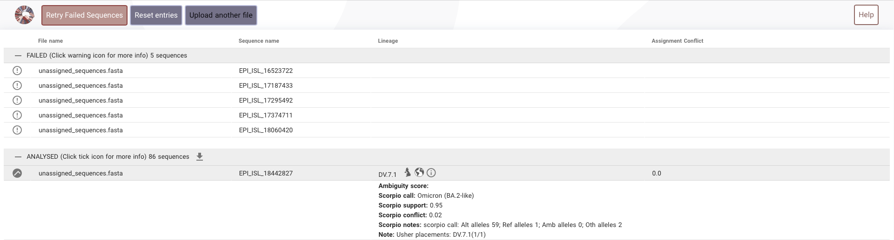
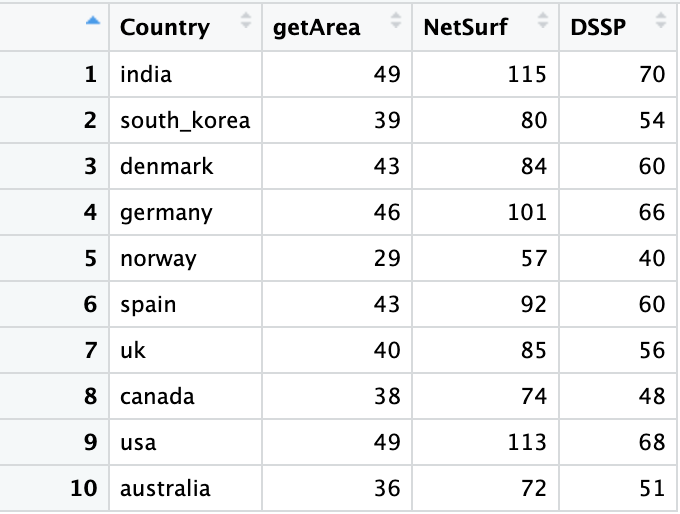

# Objective

The study is regarding the role of population genetics in the determining the susceptibility to a SARS CoV19 variant.

## Steps in the workflow


- [[Question on date|Work_documented.possible_questions#1-whyhow-was-this-particular-time-period-jan22-oct23-chosen-while-pandemic-has-been-prevelant-2020-onwards]]
  
## Data acquisition

- List of locations available in GISAID was obtained from GISAIDR Git repo - [GISAID_LOCATIONS.txt](https://github.com/Wytamma/GISAIDR/blob/master/GISAID_LOCATIONS.txt)
- The following points/steps are coded in the file ```Work/Data_Analysis/Monthwise_data_submission.Rmd```
  - From the GISAID, the total number of **_high_**, **_coverge_** completed sequence deposited by each country (200+) in the past 22 months(Jan2022-Oct2023) were retrieved in a month wise fasion using the R Package GISAIDR. The table is in ```Work/Data_Analysis/country_monthly_submission.csv```
  - Countries that had more than 10,000 sequences deposited in total in the past 22 months were alone considered further.
  - This included 10 countries : India, South Korea, Denmark, Germany, Norway, Spain, United Kingdom, Canada, USA, Australia. ```Work/Data_Analysis/chosen_ten_country_submission.csv```
  - The trend of the time series submission statistics of these countries were plotted. It is present in the file ```Work/Data_Analysis/plots/ten_Country_data_trend_plots.pdf```
  
  - Outlier detection and pruning of the observation horizon(Time period considered): Extreme low values were searched for, using the [[Hampler Filter|Glossary#hampler-filter]] (one of the [[Outlier Estimation and methods|Glossary#outlier-estimation-and-methods]]). outliers_mad from Routliers package was used . Since there were no extreme low values found in any of the countries, the observation time period was not pruned.
  - The sequence data for 10 countries were downloaded. There are files with crude data - all data retrieved from GISAID for each of the accesssion ID (29 cols of data) and there are files with essential columns: strain,virus,collection_date,country,pangolineage,sequence, length of the sequence, GISAID accession_id. The crude data for 10 countries are present 10 files in the folder ```Work/Data_Analysis/ten_country_crude_data_seq``` and the essential column files are in the folder ```Work/Data_Analysis/ten_country_ess_data```
  - The Rmd also has a codeblock for downloading data with AA_substitution. This data was needed for mapping lineages to their parental lineage. For this I used the modified download script(modified by me) ```Work/Data_Analysis/Modified_GISAIDRdownload.R```.
    > This can be done by ```fix(Download)``` and modifying the script as we need
  - This mutation data are stored in ```Work/Data_Analysis/ten_country_mut_data```
  
> There were some inconsistencies in the Date entries (only year no month or year and month an no date) such entries were removed.
> On the course of doing this it was identified that the number of entries that was downloaded for each countries do not exactly match the numbers in ```Work/Data_Analysis/chosen_ten_country_submission.csv``` excluding few countries.
> After removing the inconsistent date entries the numbers(downloaded and number in file) for India match.
> The inconsistencies are reported in the file ```Work/Data_Analysis/inconsistencies_in_data.numbers```.
> The number of downloaded entries are more than then numbers in file.
> After looking into it, it was observed that there were few more entries added to these countries in the time gap(around a week) between the compiling ```Work/Data_Analysis/chosen_ten_country_submission.csv``` and downloading data. [[Work_documented.checking inconsistencies]]
## Summary
Summary of the downloaded data

| **Country**                 | **Total number of entries downloaded (Jan22-Oct23)** | **Entries after removing the date inconsistencies** | **Number of unassigned** | **Percentage of unassigned** |
| --------------------------- | ---------------------------------------------------- | --------------------------------------------------- | ------------------------ | ---------------------------- |
| **Asia / India**            | 18106                                                | 15783                                               | 0                        | 0 %                          |
| **Asia / South Korea**      | 13808                                                | 13808                                               | 0                        | 0 %                          |
| **Europe / Denmark**        | 163900                                               | 163900                                              | 7                        | 0,004 %                      |
| **Europe / Germany**        | 66374                                                | 66236                                               | 0                        | 0 %                          |
| **Europe / Norway**         | 12264                                                | 12264                                               | 0                        | 0 %                          |
| **Europe / Spain**          | 17991                                                | 17921                                               | 0                        | 0 %                          |
| **Europe / United Kingdom** | 32835                                                | 30597                                               | 74                       | 0,242 %                      |
| **North America / Canada**  | 20791                                                | 20791                                               | 0                        | 0 %                          |
| **North America / USA**     | 75487                                                | 74971                                               | 5                        | 0,007 %                      |
| **Oceania / Australia**     | 13267                                                | 13257                                               | 5                        | 0,038 %                      |

[[Note on the unassigned|Work_documented#dealing-with-the-unassigned]]

## Mapping lineages

- Mapping of lineages to their parental lineage is done based on the Pangolin lineage naming string and the spike mutations:

  - From the 10 files of ```Work/Data_Analysis/ten_country_mut_data``` the columns corresponding to the mutations and pango lineage were extracted and stored in a different file ```Work/Data_Analysis/ten_country_mut_data/ten_country_lineage_mut.csv```.
  This is done using awk command

```Bash
awk -F";" '{gsub(/[()]/,"",$6);print $5";"$6}' 
ten_country_mut_data/* \
>ten_country_mut_data/ten_country_lineage_mut.csv
```

  >gsub is used to remove the brackets in the AA_mutations column.<br>
  >Columns of the CSV files are separated by a semicolon ';'

- All the following steps are coded in the Rmd file ```Work/Data_Analysis/Lineage_mapping.Rmd```
  - All the mutations pertaining to each of the lineage were combined.
  - From this only the spike mutations were considered for the downstream work.
  - Jaccard index (intersections of sets/Union of sets). If the Jaccard value calculated  is less than 0.5 then the lineages being compared are either considered as parental or neighbour depending on their pangolin string. [[Question on the treshold|Work_documented.possible_questions#3-the-jaccard-index-treshold-chosen-to-decide-a-parent-or-a-neighbour-is-50-is-this-okay]]
    - The Lineages were mapped to parental lineage based on the the calculated jaccard value which is based on the number of common spike mutations between pangolin lineages that have same names dropping the last character in the sublineage. VOC/VUM/VOI were explicitely mapped based on the list taken from GISAID.
  - For Pangolin lineages that are considered as VOI/VUM/VOC, the  mapping is directly given in GISAID. This can be found in the file ```Work/Data_Analysis/GISAID_VOI_VOC_VOM_list.txt```.
    - This list was obtained by first downloading the Clade/Lineage,variants(tsv) from the GISAID Downloads prompt.
    - This tsv file has multiple columns. Interesting columns were type and Value. Using the following bash commands the list of GISAID_VOI_VOC_VOMlist.txt was compiled

    ```bash
    awk -F\t '{if($3=="Variant") print $4}' \
    gisaid_variants_statistics_from_gisaid.tsv | \
    sort -u >GISAID_VOI_VOC_VOM_list.txt
    ```

    - The resulting text has long lines like _**VOI GRA (EG.5+EG.5.*) first detected in Indonesia/France**_
    from this only the variant and sublineage names EG.5+EG.5.*  are retained while other texts including the brackets are removed(manually).
    - Lines are rearranged in such a way that parental variant comes after the subvariant, example: XBB+XBB.\*    would come only after XBB.1.16+XBB.1.16.*. This rearrangement was done manually.
  
  - In total there are 1628 unique lingeages which includes variants also. Running the mapping algorithm on this gives 715 lineages mapped to 16 variants and 913 lineages getting mapped to 531 lineages which includes Unknown.
  
  > If muation list is obtained using the outbreakinfo function getMutationsByLineage then the results vary for the non-variant lineages. 912(without unknown) lineages gets mapped to 676 lineages. This is present in assigning_the_unassigned.RMD

## Frequency computation
  
- After the lineage mapping, for each country the frequency of presence of each parental_lineage(which also includes the sublienages) in a month was calculated ($\frac{count\space of\space lineage\space B\space in\space jul}{total\space entries\space in\space jul}$) with confidence interval and plotted.MultinomCI from DescTools package is used to compute the simultaneous [[Confidence interval|Glossary#confidence-interval]]. This function also calculates frequency/proportion so a seperate computation was not required.95% confidence interval with method sisonglaz was computed. The plots are stored in PDF file, 1 plot for each country so 10 pages - ```Work/Data_Analysis/plots/country_wise_frequency_trend.pdf``` without CI and ```Work/Data_Analysis/plots/country_wise_frequency_trend_CI.pdf``` with CI.
- To make it more convenient plots for each Parental_lineage/variant grouped by country was plotted to do the analysis. These are present in the pdf files - ```Work/Data_Analysis/plots/Variant_wise_trend_all_countries.pdf``` without CI and ```Work/Data_Analysis/plots/Variant_wise_trend_all_countries_CI.pdf``` with CI
- These plots are analysed to bring out the difference in the variant trend among countries. An entire spreedsheet was developed manually basically describing the variant trends in words ```Work/Data_Analysis/plot_Analysis_report.numbers```, and the summary of the analysis is in [[Analysing_variant_trends]] file.
- To not miss on the difference of pandemic in countries the lineages which are not variants were also used for comparison like the variants. There are 300+ plots in the file each page corresponding to one lineage which is not a variants and the data is grouped by country. This is presetn in ```Work/Data_Analysis/plots/Lineages_no_var_freq_countrywise_CI``` with CI and in ```Work/Data_Analysis/plots/Lineages_no_var_freq_countrywise``` without CI.
- From these plots trends that look interesting are chosen and noted in [[Analysing_variant_trends]]

## Dealing with the unassigned

- For few entries of the GISAID downloaded data the lineage was not assigned. The lineage column had either a blank space or it was termed as unassigned. There were in total 91 unassigned entries in the downloaded 10 country data.
- Denmark 7 entries ,UK 74 entries, USA 5 entries, Australia 5 which is Denmark 0.004%, UK 0.242%, USA 0.007%, Australia 0.038% of the entries in the respective countries.
- Majority of the unassigned entries were collected in Oct23
- To get the possible assignment for these entries few methods were tried out.
- First among them was to calculate distance between the unassigned and all other lineages based on their spike mutations. For this process the characteristics mutation for each lineage was obtained using the outbreakinfo function *__getMutationsByLineage__*. Lineages that had less distance to each of the unassigned entries were considered as possible assignment.
- Though this method seems to work when the method was checked with entries with known assignments, the method did not perform well.
- The main reason that this wouldn't work is beacuse not all the characteristic spike mutation is always present in the GISAID downloaded data, so when distance is computed there is always discrepencies.
- Hence to go with an accurate method genome sequences of these unassigned entries were obtained and a fasta file was compiled.
- This file ```unassigned_sequences.fasta``` was uploaded in the <https://pangolin.cog-uk.io> to get the assignment.
- Once the assignment was obtained it was added to the dataset. This part is included in the fill_parental function of lineage_mapping. The trends were reanalysed after assigning the unassigned.
  > The <https://pangolin.cog-uk.io> was not able to analyse the 5 sequences from australia. No reasons was provided.




- All these are present in the ```Work/Data_Analysis/assigning_the_unassigned.Rmd```

## Finding positions under pressure (BIG GOAL)

The big goal is to find the positions under pressure. To obtain this, firstly the frequency of each position(RBD spike mutations in position 330-530)([[question on the position|Work_documented.possible_questions#7-aaccording-to-uniprot-the-rbd-region-in-spike--is-319-541aa]]) in the aa_substitution has to be first calculated and interpolated to get the daily data.


- For Each country the mutation data from GISAID has been used as the input.
- This data consist of the lineage, collected date, location of collection, a string of aa_substitution.
- All the aa_substitution strings that are collected on the same day are considered together. This also gives the number of entries collected in a day = number sequences
- From these strings the spike RBD mutations are alone extracted using getRBDmut function.
- The data frame gets reduced to date,number of sequences,spike RBD mutations string.
- To calculate the frequency for a time step all the possible unique spike RBD mutations present in the country is first compiled.
- Then the frequency of each of this mutation for a day is calculated.
  > Frequency of pos_373 on 01-01-2022 = $\frac{count\space of\space pos\_373\space on\space 01-01-2022}{Number\space of\space sequences\space on\space 01-01-2022}$
- To have the frequency data for everyday from Jan 1 2022 - Oct 31 2023, linear [[interpolation|Glossary#interpolation]] is done using the approximate method. The result of the interpolation is added to the corresponding date in the country data_frame.
  
>- [[Question on combining daywise|Work_documented.possible_questions#4-where-could-combining-the-data-on-daily-basis-and-then-interpolating-them-to-get-the-missing-day-data-go-wrong]]
>- [[Question on week-day interpolation|Work_documented.possible_questions#5-if-data-is-combined-weekly-how-should-this-frequency-be-distributed-among-the-week-to-get-the-week-daily-interpolation]]
>- [[Question on the interpolation method|Work_documented.possible_questions#6-why-do-we-do-linear-interpolation-why-not-spline-interpolation]]

## Computing the pressure on the position

With the formula (given by Prof.Max) the pressure on each position was computed
$\\ P(pos,s)=\sum_{s=t_0}^{t}\exp^{-k[t-s]}\times f(pos,s) \\$

- Where the f(pos,s) is the frequency of the position on time s.
- $exp^{-k[t-s]}$ is the discount factor - mutation frequencies that occurred [t-s] days ago get discounted by the half life of neutralising antibodies.
- $k\sim \frac{ln(2)}{45+14}$
- By suggestion of the Prof. the vector for discount factor was first computed. For this the date range for each of the country_df was found. If the difference between the sart day and the end day is 9 then [t-s] could be in the range 0-9. Hence with this as base the discount factor was computed for [t-s] ranging 0-[difference between the start day to end day in the dataframe]. All these values are stored in a vector.
- According to the selected $t_0$, $t$ the discount factor vector was sliced and the frequency of the particular position in the time duration $t_0$ to $t$ was matrix multiplied to get the pressure on the position.
- This was done for all the RBD positions in a country and repeated for all the 10 countries.
- The output will have two columns - RBD posisition and the pressure on the position.

## Masking

- The objective of masking to find the exposed positions among the RBD spike positions.
- To know the exposed residues the solvent accessibility of each of the residues in the spike protein were found. [[question on mutations and solvent accessibility|Work_documented.possible_questions#8-if-a-rbd-spike-position-in-the-wildtype-is-occupied-by-a-hydrophobic-residue-and-it-is-replaced-by-hydrophilic-residue-the-solvent-accessibility-might-changes-right-due-to-possible-difference-in-the-fold-in-that-case-should-we-study-these-positions-in-each-of-the-voi]]
- To find solvent accessibility of the protein various tools were utilitsed. This can be found here[[Work_documented.Finding_surface_residues]]
- From the output of each of the tool Spike RBD surface positions were found. This process was direct in the case of the output from GetArea and Netsurf3.0 but in the case of DSSP, relative solvent accessibility was computed from the absolute solvent accessibility in the dssp output file. Using this computed relative solvent accessibility the surface residues were found.
  
> The categorising treshold is set as 25% similar to Netsurf3.0. This would need advice.

- The number of surface residues flagged by the 3 tools vary.
  
> Dssp : 170 residues, NetSur3.0 : 101 residues, GetArea : 104 residues. Though the numbers of getArea and Netsurf are matching, they only flag 28 positions commonly, others are all different. DSSP and Netsurf3.0 share 49 commonly flagged positions. GetArea and Dssp doesn't flag any position commonly.

- Residues flagged by each of the tools are fished from the ten country's position under pressure dataframe. The numbers are tabulated .

## Visualization of the positions under pressure

- To know how the positions under pressure would differ by country I thought heat map will be the good choice
- To do this a dataframe was created with a column of all the Spike RBD positions given by the tool. Other 10 columns belonging to each of the 10 countries. These columns contain the pressure for each of the positions that was computed using the mutation . If a position has no record of mutation in a country it is assigned to zero.
- This dataframe is reshaped to make it usable for geom_tile.
- The heat map is then plotted on this reshaped dataframe. 
- This was done for the outputs from all 3 tools and the heatmap is saved in different pdfs with ```Work/Data_Analysis/netsurf_based_output.pdf```,```Work/Data_Analysis/dssp_based_output.pdf```,```Work/Data_Analysis/getArea_based_output.pdf```.

> Inference based on netsurf based output:
> Pos_339,pos_460: Apart from Australia all other contries have high pressure on this position
> Pos_346,pos_477,pos_478,pos_484,pos_498,Pos_501: Apart from India all other countries have high pressure.
> pos_375,pos_376,pos_408: Apart from south korea all other countries have high pressure

```Work/Data_Analysis/Big_goal.Rmd``` has all the scripts regarding the big goal.

[Definition Reference](https://www.cdc.gov/coronavirus/2019-ncov/variants/variant-classifications.html)
