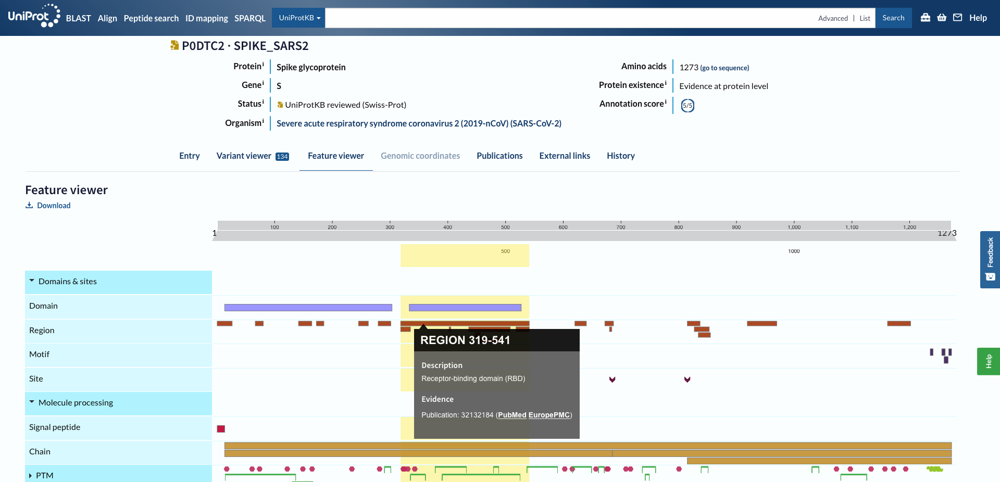

### 1. Why/How was this particular time period (Jan22-Oct23) chosen, while pandemic has been prevelant 2020 onwards?

- ANS:

### 2. There are continuous deposition of sequences to GISAID even for the earlier dates, the following tables shows the difference in numbers. Will calculating CI account these changes ?

Country|Number of downloaded(18-20 Nov 23)|Number in GISAID at later date(8 Dec 2023)
-------|--------------------|------------------------------
India|15783|15809
South_korea|13808|13826
Denmark|163900|163905
Germany|66236|66244
Norway|12264|12264
Spain|17921|18039
UK|30597|30606
Canada|20791|20802
USA|74971|75165
australia|13257|13261

- ANS: If there is major difference CI wouldn't account for these. In that case we have to either redownload new set of data or we have to jjust specify the date of download in the report
  
### 3. The jaccard index treshold chosen to decide a parent or a neighbour is 50%. Is this okay?

- ANS: Jaccard index is not the right way to go about, we have to get the distance, create a distance table based on the spike mutations.

### 4. Why do we do linear interpolation, why not spline interpolation?

-ANS:

### 5. Aaccording to Uniprot the RBD region in spike  is 319-541aa 

ANS:

### 6. If a RBD spike position in the wildtype is occupied by a hydrophobic residue and it is replaced by hydrophilic residue, the solvent accessibility might change probably due to the difference in the fold.  In that case should we study these positions in each of the VOI?

ANS: