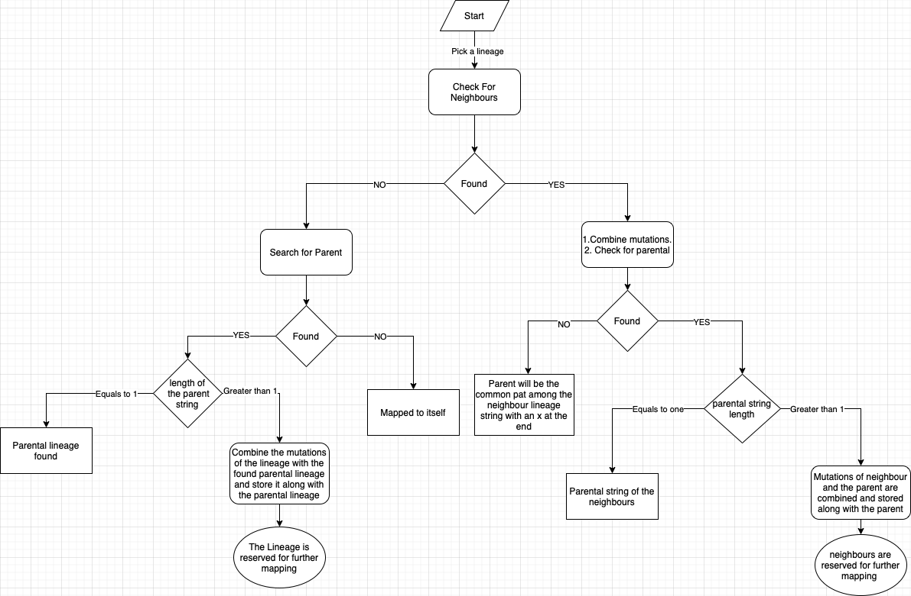

<!-- mermaid.js -->

<!-- paginate: skip -->
# Objective

Studying the influence of the population genetics in the SARS CoV2 variant susceptibility

---
<!-- paginate: true -->
# Work done in steps

---

## Mapping Lineages

### For the variants
<ul>
 <li>BA.2.86+BA.2.86.*</li>
 <li>B.1.351+B.1.351.2+B.1.351.3</li>
 <li> B.1.617.2+AY.*</li>
 <li> B.1.1.529+BA.*</li>
 <li> XBB.1.16+XBB.1.16.*</li>
 <li> XBB.1.5+XBB.1.5.*</li>
 <li> XBB.1.9.1+XBB.1.9.1.*</li>
 <li>XBB+XBB.*</li>
</ul>

---

### For other lineages

---

---

# Inference
[Interesting inference](https://vishnushiri02.github.io/SARS-Cov2/notes/1hnn8maoednnxdw5feqd4kq/)